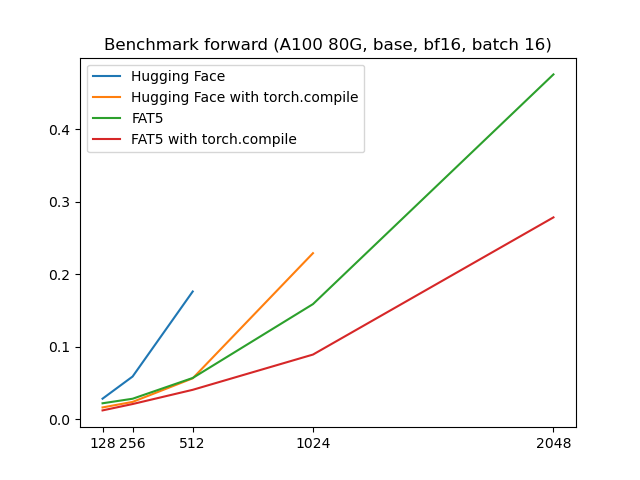
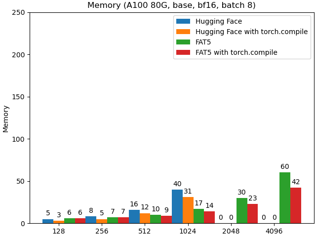
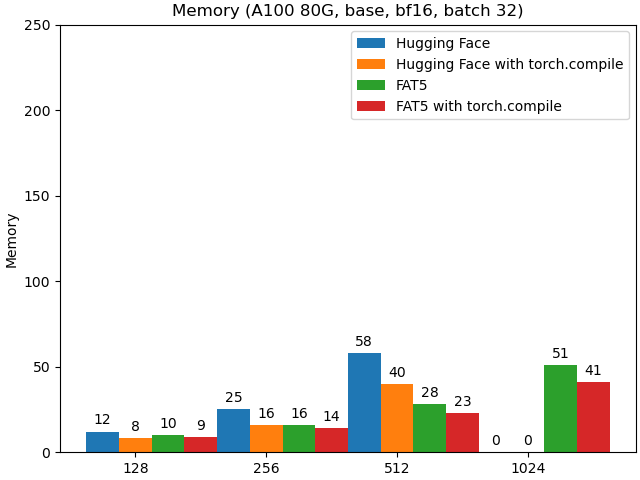

# FAT5 - A fast implementation of T5/UL2 with Flash Attention

**⚠ WARNING: This repository is not yet complete. Please refer to the roadmap part of this README. ⚠**

FAT5 (for **F**l**A**sh**T5**) is an implementation of T5 in PyTorch with an UL2 objective optimized for GPGPU for both training and inference.
It uses an experimental feature for using [Flash Attention (v2)](https://arxiv.org/abs/2307.08691) with relative position encoding biases
that allow to train or finetune the model on longer sequence lengths than the original T5. It also has support for other positional embeddings such as RoPE or ALiBi.

## Motivation

While a lot of effort has been focused on optimizing decoder-only models, in many practical applications older architectures remains useful.
We focus on [T5](http://jmlr.org/papers/v21/20-074.html) by Raffel et al. (2020), an encoder-decoder architecture exhibiting very decent performances for [instruction tuning](https://arxiv.org/pdf/2306.04757.pdf) or even sometimes outperforming much larger models when [finetuned](https://arxiv.org/pdf/2402.00841.pdf). Moreover its a natural architecture while considering [distillation](https://arxiv.org/abs/2305.02301) of much larger models.

A critical limitation of this model is the length of the sequence that these model can deal with due to the quadratic size in memory. While this
quadratic term cannot be removed without considering other form of attention (like for [LongT5](https://arxiv.org/abs/2112.07916)), it can
still be alleviated to accomodate longer sequence lengths.

## Our work

We used the [nanoT5](https://github.com/PiotrNawrot/nanoT5?tab=readme-ov-file#cite) implementation (Nawrot, 2023)  as the base for our work.

We worked on optimizing the core component of the model, witch is the attention part. We used the [Flash Attention (v2)](https://arxiv.org/abs/2307.08691) by Dao (2023) that optimize both the memory usage and the efficient use of Tensor Cores.

While the original implementation does not support attention biases, we added this component in this [PR](https://github.com/Dao-AILab/flash-attention/pull/617). The implementation support full attention biases (batch_size, num_heads, seqlen_q, seqlen_k) or partial attention biases (1, 1, seqlen_q, seqlen_k). The latter allow us to remove the full size attention mask in the implementation of T5, while the causality can be enforced by masking in the kernel itself, thus reducing the memory by a factor of the size of batch for this tensor. This allow to fit larger batch sizes and thus increasing throughput during training.

<picture>
  <source media="(prefers-color-scheme: dark)" srcset="./assets/FAT5_dark.gif">
  
</picture>

Other parts of the architecture where optimized using [ad-hoc Triton kernels](src/model/ops/) for the cross-entropy (and z-loss) and layernorm. We also provide a [Triton implementation of Flash Attention 2](src/model/ops/flash_attention_v2_bias.py) supporting attention biases for those who do not like to recompile a custom patch for the flash attention. Beware that this implementation is not yet complete and only work when sequences in the encoder and decoder are of the same size (see the [Roadmap](#roadmap)).

For pretext tasks during pre-training, we use the [UL2](https://arxiv.org/abs/2205.05131v3) mixture of denoisers by Tay et Dehghani (2022) with the following 7 tasks:

  ```python
  denoiser_list=[
  {"mu": 3.0, "r": 0.15, "max_spans": max_token_length, "prefix": "[R]"},
  {"mu": 8.0, "r": 0.15, "max_spans": max_token_length, "prefix": "[R]"},
  {"mu": 4.0, "r": 0.0, "max_spans": 1, "prefix": "[S]"},
  {"mu": 3.0, "r": 0.5, "max_spans": max_token_length, "prefix": "[X]"},
  {"mu": 8.0, "r": 0.15, "max_spans": max_token_length, "prefix": "[X]"},
  {"mu": 64.0, "r": 0.15, "max_spans": max_token_length, "prefix": "[X]"},
  {"mu": 64.0, "r": 0.5, "max_spans": max_token_length, "prefix": "[X]"}],
  denoiser_proportions=[0.165, 0.165, 0.34, 0.0825, 0.0825, 0.0825, 0.0825]
  ```
  where `mu`: the span size, `r`: the % of masking in the span and `prefix`: the type of the pretext task (the meaning of the letters `[R]`, `[S]` and `[X]` is described [here](https://huggingface.co/google/ul2#mixture-of-denoisers)).

As there was no implementation available in PyTorch, we [added one](src/data/data_collator_ul2.py) and adapted a dynamic batching mechanism to reduce padding in the model.

## Benchmarks

The benchmarks were made on a A100 80G by comparing to the [original implementation of T5 v1.1](https://huggingface.co/docs/transformers/model_doc/t5v1.1) available on Hugging Face

  |  

We see that below sequence length of 256, torch.compile does a pretty good job in optimizing the model while the Flash Attention
start to pick up speed at 512 length and above. Note that the orignal model cannot accomodate larger than 512 sequence length despite using a 80G GPU !
We tried to support both torch.compile and Flash Attention 2 to get the best of both worlds but the model is still buggy with PyTorch 2.2 (see the [Roadmap]()). You can find a torch compilable interface to Flash Attention 2 [here](src/utils/fa2_lib/).

We can see a clear improvement in memory usage in our implementation for larger batch sizes :

  |  

## Pretraining

We tested and trained the model on A100. It may or may not work with other GPUs.
The training script is provided [here](train_flash_t5.py). It assumes that the dataset is already pretokenized and uses Hugging Face trainer.
```python
python train_flash_t5.py config/flash-t5-base.yaml
```

It support accelerate for out of the box distributed training.

## Finetuning

TBA

## Application to French
We've used the codes of this repository to pretrain two FAT5-UL2 in French, a base version (305M parameters) and a large version (973M parameters).
The weights will soon be released.
Models are pre-trained on the French part of the [CulturaX](https://huggingface.co/datasets/uonlp/CulturaX) corpus by Nguyen et al. (2023), i.e. 1,258 GB of text.
The models were run on a single A100; for 11 days for the base version and 30 days for the large version.

## Roadmap
Here is several following up work that we would like to make :

- Fixing the compilation with PyTorch 2.2 : the current implentation doesn't support compiling together with the custom FA2 and Triton kernels.

- Proper Triton Flash Attention 2 implementation : the current implentation doesn't support keys and queries of different length,
we may use a more complete implementation of FA2 in Triton such as [this one](https://github.com/FlagOpen/FlagAttention).

## License
[Apache-2.0 license](https://github.com/catie-aq/flashT5/tree/main?tab=Apache-2.0-1-ov-file#readme)

## Ackowledgment

We use the following repos and thanks the authors for this :
- [nanoT5](https://github.com/PiotrNawrot/nanoT5) for the optimizer.
- [Flash attention](https://github.com/Dao-AILab/flash-attention) for the groundbreaking algorithm for computing attention.
- [Unsloth](https://github.com/unslothai/unsloth) for the Triton kernels of the cross-entropy and layernorm that we adapted to our usage.


This work was support by the [Vaniila platform](http://vaniila.ai/).<br>
[](http://vaniila.ai/)
